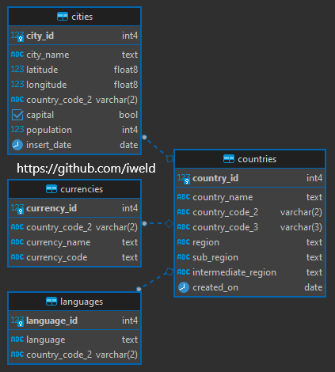

## Shaker's SQL Analytics Code Challenge
### PostgreSQL Project

**Author**: Jaime M. Shaker

**Email**: jaime.m.shaker@gmail.com

**Website**: https://www.shaker.dev

**LinkedIn**: https://www.linkedin.com/in/jaime-shaker/ 

:exclamation: If you find this repository helpful, please consider giving it a :star:. Thanks! :exclamation:

### Foreign Keys

All of our tables in the `cleaned_data` schema share a common field named `country_code_2`.  We also know that this field is `UNIQUE` in the `cleaned_data.countries` table because there can only be one country code per country.

Using this information, we can make the `cleaned_data.countries` table the parent table and all other tables can have a [One-to-One](https://fmhelp.filemaker.com/help/18/fmp/en/index.html#page/FMP_Help/one-to-one-relationships.html) `FOREIGN KEY` relationship to it.

First, create a new script and name it `create_relationships.sql`.  Create a query to `ALTER` the `cleaned_data.countries` table and add the `UNIQUE` constraint to the `country_code_2` field.

```sql
-- Alter cleaned_data.countries and add the UNIQUE constraint to country_code_2
ALTER TABLE 
	cleaned_data.countries 
ADD CONSTRAINT 
	unique_country_code_2 
UNIQUE (country_code_2);
```

Now we can `ALTER` the child tables and add a `FOREIGN KEY` constraint.

```sql
-- Alter all other tables and add a foreign key constraint and reference.
-- Create Foreign Key relationship for cleaned_data.cities
ALTER TABLE 
	-- Table to be altered
	cleaned_data.cities
ADD CONSTRAINT 
	-- Give this constraint a name
	fk_country_city 
	-- Which key in cleaned_data.cities is a foreign key
FOREIGN KEY (country_code_2)
	-- Which key to reference from parent table
REFERENCES cleaned_data.countries (country_code_2);

-- Create Foreign Key relationship for cleaned_data.currencies
ALTER TABLE
	cleaned_data.currencies
ADD CONSTRAINT 
	fk_country_currencies
FOREIGN KEY (country_code_2)
REFERENCES cleaned_data.countries (country_code_2);

-- Create Foreign Key relationship for cleaned_data.languages
ALTER TABLE 
	cleaned_data.languages
ADD CONSTRAINT 
	fk_country_languages 
FOREIGN KEY (country_code_2)
REFERENCES cleaned_data.countries (country_code_2);

```

Once you execute the complete script and have created a `FOREIGN KEY` constraint for all of our other tables, your `Entity Relationship Diagram` should look something like this.



We are now ready to complete the `SQL Coding Challenge`.

click the link below

Go to [WALKTHROUGH_CODE_CHALLENGE](WALKTHROUGH_CODE_CHALLENGE.md)

:exclamation: If you found the repository helpful, please consider giving it a :star:. Thanks! :exclamation:


